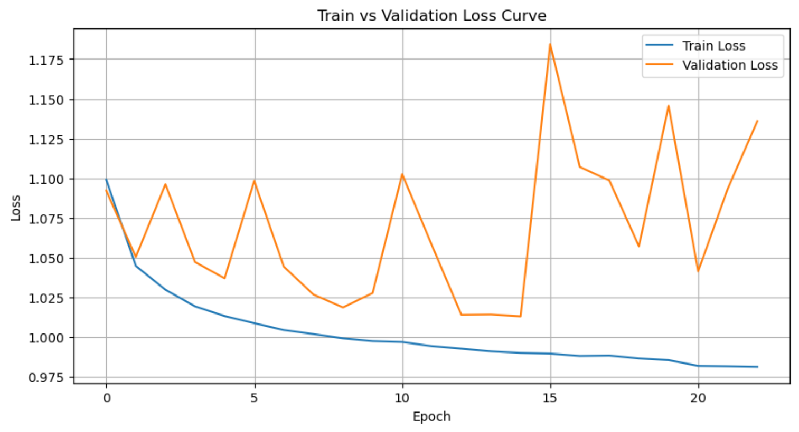
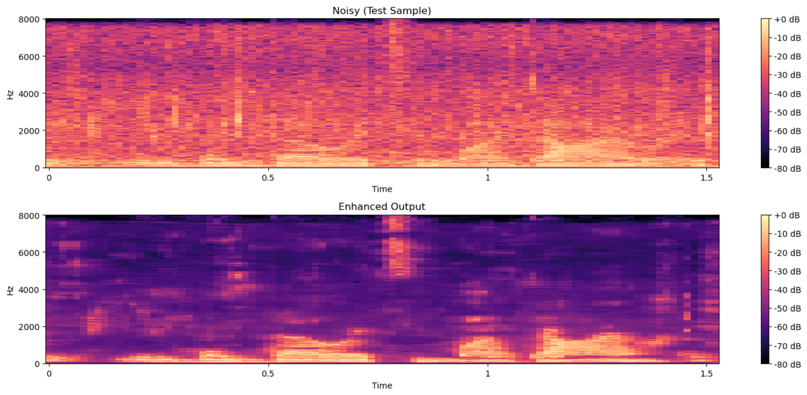
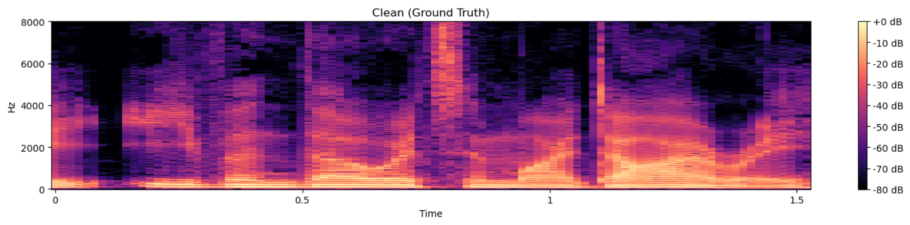

# Speech Enhancement with CNNs

## Overview
This project aims to build a speech enhancement model using CNNs to remove noise from speech audio.

It demonstrates practical skills in:

- Audio signal processing
- Deep learning with PyTorch
- Data engineering for ML tasks
- Model training, tuning, early stopping
- Visual analysis using spectrograms
- Experiment analysis and documentation

## Data Preparation

1. Audio collection

- 10 clips of clean speech audio files from BBC Learning English Podcast.
- 8 clips of ambient noise audio downloaded from freesound.com. 
- Resampled to 16 kHz and converted to mono WAV audio using Adobe Audition.

2. SNR-based mixing

Mixtures created at: 10 dB, 5 dB, 0 dB, -5 dB.

3. STFT:

- n_fft = 512
- hop_length = 128
- Extracted magnitude & phase 

4. Patch extraction

Split into 64-frame blocks on time axis.

5. Dataset split:

- Training: 80%
- Validation: 10%
- Test: 10%

## Model Training

1. Model architecture:
The CNN predicts a mask M(f, t) between 0 and 1:
\[
Enhanced(f, t) = Mask(f, t) * Noisy(f, t)
\]

- Conv2d (1 → 32), BatchNorm2d, GELU
- Conv2d (32 → 64), BatchNorm2d, GELU
- Conv2d (64 → 64), BatchNorm2d, GELU
- Conv2d (64 → 32), BatchNorm2d, GELU
- Conv2d (32 → 1), Sigmoid
Output shape: [batch, 1, freq_bins, frames].

2. Training loop:
- Optimizer: AdamW
- Loss: L1 loss
- Scheduler: StepLR (optional)
- Early stopping: patience = 8

3. The best model is saved as:
`cnn_enhancer_best.pth`

## Evaluation
A separate test loop measures model performance on unseen data with the final test loss of 0.993886.
The training and validation loss curve indicates that the model successfully learned features from training data, but also shows signs of overfitting.

Spectrogram comparison:

### Enhanced Audio Samples

- [Noisy sample](test/noisy_test_20250701_01.wav)
- [Enhanced sample](test/enhanced_test_20250701_01.wav)
- [Clean sample](test/clean_test_20250701_01.wav)

## Future Work
Training dataset diversity needs to be increased with speech audio of more people and mixed at more SNR levels. CNN model needs to have more complex structure. U-Net or CRN architectures are considered.
